# Architecture

The project separates portable behavior from ESP32 services and board-specific
hardware. This allows another ESP32 PCB to reuse the same PixLite Mk3, ADAR,
configuration, trigger, and web-interface behavior.

## Design goals

- Keep GPIO scanning deterministic when HTTP is slow.
- Bound every large collection and network response.
- Keep hardware pin knowledge out of portable policy code.
- Preserve configuration across firmware and board-profile migrations.
- Produce an Arduino-friendly single-file artifact without making it canonical.
- Make failures diagnosable without logging credentials.

## Source layers

### Core

`firmware/AdvatekTrigger/src/core/` contains platform-light, host-testable
policy:

- input debounce and edge state;
- latest-event-wins and offline expiry;
- action and intensity-ramp policy;
- ADAR packet encoding/decoding;
- PixLite Mk3 request and response rules;
- configuration types, defaults, validation, JSON, and migrations;
- recovery timing and memory-mode decisions.

Core code must not introduce board pin numbers, NVS, Wi-Fi, Ethernet, HTTP
server, FreeRTOS, or UI behavior.

### ESP32 platform

`firmware/AdvatekTrigger/src/platform/` adapts the core to Arduino-ESP32:

- GPIO and time;
- the network task and one-element action mailbox;
- W5500/Wi-Fi/AP/mDNS/DNS lifecycle;
- ADAR UDP and PixLite Mk3 HTTP;
- two-slot NVS configuration;
- web API, authentication, diagnostics, and PSRAM resources.

Large device, media, diagnostic, token, and response buffers are allocated in
PSRAM. If the required PSRAM workspace cannot be created, the device enters a
degraded recovery mode instead of moving those allocations into scarce
internal networking heap.

### Board profiles

`firmware/AdvatekTrigger/src/boards/` is the only place that knows the
Waveshare pinout and Ethernet startup callback. `boards/manifest.json` mirrors
the release-facing board metadata used by tests, documentation, and tooling.

Adding a PCB is an additive profile and build target. See
[PORTING.md](../PORTING.md).

## Runtime flow

```mermaid
flowchart LR
    Contact["Dry contact edge"] --> Scan["Fast GPIO scan"]
    Scan --> Debounce["InputEngine debounce"]
    Debounce --> Mailbox["Latest-action mailbox"]
    Mailbox --> Network["Serialized network task"]
    Network --> Resolve["Resolve target PixLite Mk3"]
    Resolve --> HTTP["PixLite Mk3 API v1.x"]
    HTTP --> Status["Status/media cache in PSRAM"]
    Status --> API["Streamed local web API"]
    API --> UI["Embedded Advatek Labs SPA"]
```

The GPIO loop never waits for PixLite Mk3 HTTP. Publishing a newer edge replaces
the pending action. The network task discards an action older than two seconds,
which prevents a stale press from firing after reconnection.

Intensity hold/repeat state is driven by the physical input. The inverse edge
stops a ramp before its own configured action executes.

## Network ownership

The selected operational uplink is explicit:

- Ethernet, or
- Wi-Fi Station.

There is no automatic fallback between them. BOOT recovery is time-limited and
uses the configured Wi-Fi AP or direct-Ethernet DHCP connection; normal
commissioning uses Ethernet and `advatrigger.local`. Direct-Ethernet recovery
is refused while the W5500 has link, preventing a DHCP server from being
started on an installed LAN.
PixLite Mk3 HTTP is intentionally serialized through one client and one reusable
32 KB response buffer, keeping socket and memory use predictable with up to 16
saved controllers.

## Configuration

Configuration is stored in two NVS slots with schema version, sequence number,
and CRC. A save writes the inactive slot first. On failure, sequence state is
rolled back and the active valid record remains usable.

The model separates:

- **Portable settings:** PixLite Mk3 controllers, logical inputs, actions, debounce, network
  intent, LED preference, and UI behavior.
- **Hardware binding:** board ID, board-profile version, and logical-input GPIO
  assignments.

Frozen structures preserve older schema layouts. Migration never silently
moves physical wiring to a different pin; unavailable assignments become
unassigned and require an installer decision.

## Web interface and API

`web/` is editable Vite/TypeScript source. It is built as one minified HTML
document, compressed with deterministic gzip settings, and emitted to
`src/web/WebAsset.h`. Large API reads are streamed rather than assembled as
one temporary response string.

The local API contract is documented in [API.md](API.md). It is local HTTP, not
TLS, and is intended for a trusted LAN or control VLAN.

## Generated Arduino sketch

`tools/build-sketch.mjs` reads the board manifest and amalgamates canonical
headers into, for every target:

- a raw `.ino` for direct download; and
- a same-named Arduino sketch folder for compilation and zipped releases.

Readable module banners and comments remain in the generated file. CI runs the
generator in check mode and fails when committed artifacts drift. Never fix a
generated sketch directly; change canonical source and regenerate it.

## Testing boundaries

- `tests/native/` exercises portable C++ policy with a host compiler.
- Vitest repository contracts verify manifests, memory bounds, API vocabulary,
  UI affordances, and migration expectations.
- Arduino CI compiles canonical firmware and every generated board sketch; the
  original Waveshare target also retains its hardware canary.
- [HARDWARE-TESTS.md](../HARDWARE-TESTS.md) records evidence that cannot be
  established by compilation or mocks.

Automated success is necessary but does not confer hardware-ready status.
