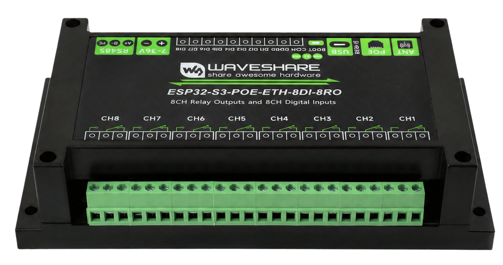
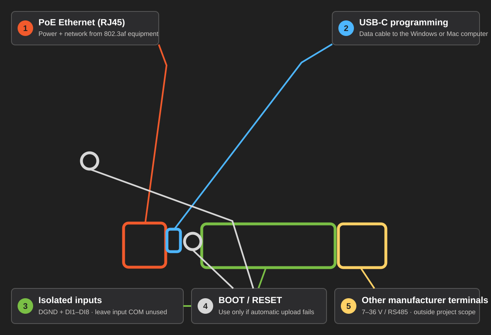
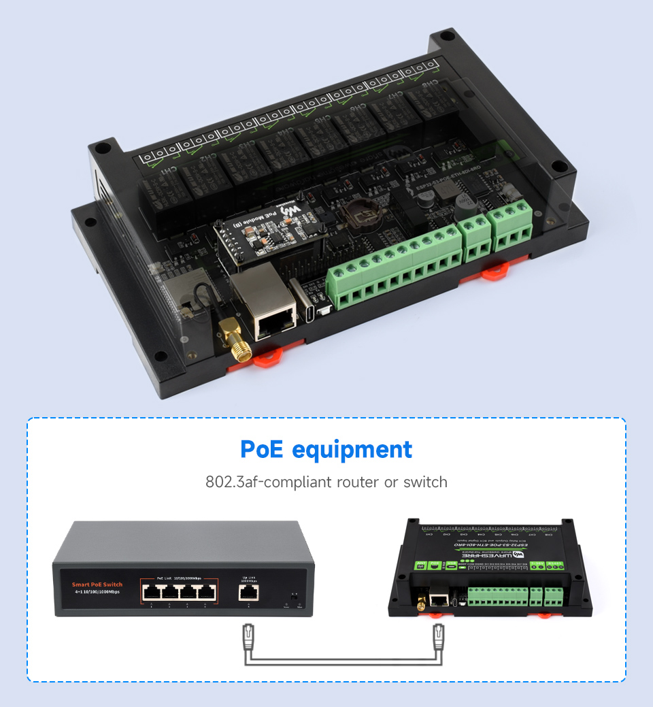
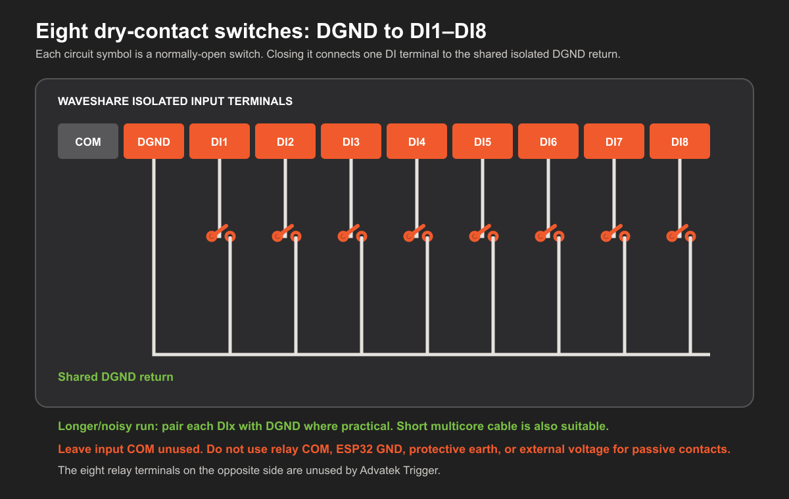
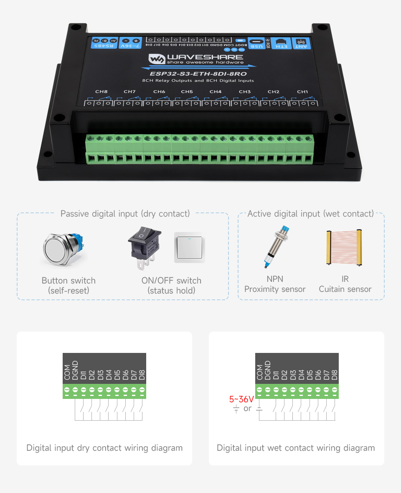

# Getting started: Waveshare industrial 8DI board

This guide covers both the **Waveshare ESP32-S3-ETH-8DI-8RO** and
**ESP32-S3-POE-ETH-8DI-8RO**. PoE changes the power hardware only; both models
use the same Advatek Trigger firmware download.

The instructions below concentrate on the PoE version. Waveshare specifies an
IEEE 802.3af PoE Ethernet port, a USB-C connector for power, firmware download
and USB communication, and eight bidirectionally opto-isolated digital inputs.
See the
[official Waveshare product page](https://www.waveshare.com/esp32-s3-eth-8di-8ro.htm?sku=30838)
for the manufacturer's complete electrical specification.

This is an Advatek Labs community-beta installation guide. Use the exact
board-specific download, follow the manufacturer's electrical specification,
and evaluate the completed installation for its intended environment.

PixLite Mk3 SHOWTime scene and playlist playback also requires a suitable
industrial-grade microSD installed in the PixLite Mk3. The industrial ESP32
board's own TF/microSD slot is unused by this firmware.

First-time Arduino users should follow the
[illustrated flashing guide](FLASHING-WITH-ARDUINO.md). It shows the shared
ESP32-S3 board settings and upload process with real Arduino IDE screenshots.

## Identify the PoE board connections

1. **PoE Ethernet:** connect this RJ45 socket to an IEEE 802.3af PoE switch or
   injector for normal power and network operation.
2. **USB-C programming:** connect a data-capable USB-C cable directly to the
   Windows or Mac computer when flashing.
3. **Isolated inputs:** for passive buttons, switches, and dry relay contacts,
   use `DGND` and `DI1` through `DI8`. Leave the neighbouring `COM` terminal
   unused.
4. **BOOT and RESET:** use these only if the board does not enter download mode
   automatically.
5. **Other terminal group:** the labelled 7–36 V input and RS485 terminals are
   manufacturer features. They are not used or covered by this project guide.

The eight large relay-output terminal groups on the opposite edge are also
unused by Advatek Trigger.

The underlying product photograph is from Waveshare and remains copyright
Waveshare. See the
[image attribution and original sources](assets/waveshare-official/README.md).

## Download the correct build

Download
[AdvatekTrigger-Waveshare-ESP32-S3-ETH-8DI-8RO.zip](https://github.com/AdvatekLabs/PixLite-Mk3-Contact-Trigger/releases/download/v1.0.0-beta.6/AdvatekTrigger-Waveshare-ESP32-S3-ETH-8DI-8RO.zip),
extract it, and open the same-named `.ino` file. Do not use the
`ESP32-S3-ETH` sketch: its Ethernet and input pins are different.

If no release exists yet, use the
[generated repository sketch](../generated/AdvatekTrigger-Waveshare-ESP32-S3-ETH-8DI-8RO/AdvatekTrigger-Waveshare-ESP32-S3-ETH-8DI-8RO.ino).

## Arduino IDE settings

Install `esp32` by Espressif Systems version **3.3.10**, select
**ESP32S3 Dev Module**, and use:

| Option | Required value |
| --- | --- |
| Flash Size | `16MB` |
| Partition Scheme | `Huge APP (3MB No OTA/1MB SPIFFS)` |
| PSRAM | `OPI PSRAM` |
| USB Mode | `Hardware CDC and JTAG` |
| USB CDC On Boot | `Enabled` |

## Flash from a computer over USB-C

Use a USB data connection for the first controlled upload:

1. Disconnect the PoE cable and any external DC supply. Leave the field-input
   and relay terminals unwired.
2. Connect a **data-capable USB-C cable** from the board's USB socket to the
   computer. A charge-only cable supplies power and provides no serial port.
3. In Arduino IDE, select the new COM port on Windows or
   `/dev/cu.usbmodem...` port on macOS.
4. Confirm **ESP32S3 Dev Module** and every build option in the table above.
5. Select **Upload** and wait for **Done uploading** before disconnecting USB.

For the first upload, using USB-C by itself avoids bringing up the untested
board with two power sources. If automatic download mode fails:

1. Hold **BOOT**.
2. Briefly press and release **RESET**.
3. Start **Upload** in Arduino IDE.
4. Release **BOOT** when Arduino begins writing.

## Choose operational power and connect Ethernet

- For the PoE model covered by this guide, disconnect USB-C after the successful
  first upload, then connect the RJ45 socket to an IEEE 802.3af PoE switch or
  suitable 802.3af injector. This carries power and network data in one cable.
- The board also exposes manufacturer-provided external-DC terminals. Selecting,
  wiring, and validating that power arrangement is outside this project's v1
  scope; follow Waveshare's electrical documentation if evaluating it.
- Do not intentionally combine power sources unless the manufacturer's
  documentation explicitly permits the proposed arrangement.
- Connect the PixLite Mk3 and computer to the same LAN. The computer can use
  another switch/router port or Wi-Fi, provided it remains on the same local
  network.
- A normal non-PoE router, switch, or computer Ethernet socket carries data but
  does not supply power.

Waveshare's example switch is illustrative only; any correctly configured
IEEE 802.3af PoE switch or injector with Ethernet data passthrough is suitable.

At a healthy boot, Serial Monitor at `115200` reports 16 MB flash, 8 MB PSRAM,
W5500 initialization, and the DHCP address. Open `http://advatrigger.local/`,
or the displayed numeric address. Ethernet is the commissioning connection;
Wi-Fi Station can be selected later as the operational uplink.

Ethernet DHCP/static and Wi-Fi Station DHCP/static were validated on the PoE
industrial-board sample using its supplied antenna. If the `.local` address
does not resolve after switching, open the numeric address reported over USB
Serial or shown by the router.

Wi-Fi and Ethernet are explicit operating modes; failed Wi-Fi does not
automatically fall back to the wired port. The SPA selects the BOOT recovery
connection. Hold BOOT for 5–14 seconds and release, then either join the
temporary `Advatek-Trigger-XXXXXX` Wi-Fi network or use direct Ethernet. A
phone should open the Wi-Fi setup page automatically; if it does not, open
`http://192.168.4.1/` in its full browser. Select **Save network and restart**,
then **Tap again to save and restart**. For
direct-Ethernet recovery, unplug the installed network before holding BOOT and
release it while the LED alternates orange and white. The controller restarts
once into isolated recovery mode and holds the LED white while it starts. Wait
for the LED to pulse cyan and only then connect one computer directly. A
normal computer Ethernet port will not
provide PoE, so power the controller from USB-C during this direct-cable
recovery. Open `http://192.168.4.1/`; recovery expires after 15 minutes.
To leave direct-Ethernet recovery early, reconnect the normal LAN and
power-cycle the enclosed controller; access to the internal RESET button is
not required.

The status LED alternates orange and white while authentication recovery is
armed. After release it stays white while recovery starts, then pulses blue
for Wi-Fi recovery or cyan for direct Ethernet recovery. A flashing red
indication means the selected recovery
connection could not start; normal steady orange returns after five seconds.

## Isolated input terminals

This board maps its eight isolated field inputs as follows:

| Enclosure terminal | Firmware GPIO |
| --- | --- |
| DI1 | GPIO4 |
| DI2 | GPIO5 |
| DI3 | GPIO6 |
| DI4 | GPIO7 |
| DI5 | GPIO8 |
| DI6 | GPIO9 |
| DI7 | GPIO10 |
| DI8 | GPIO11 |

For the passive buttons and contact closures used by this project:

1. Remove PoE and USB power before changing terminal wiring.
2. Leave the first input terminal, **COM**, empty. It is used only by
   Waveshare's active/wet-input arrangements, which are outside this project's
   contact-closure scope.
3. Connect one side of the dry contact to the board's isolated **DGND**
   terminal.
4. Connect the other side to the chosen **DI1–DI8** terminal.
5. For a switch several metres away, preferably carry `DGND` and its `DIx`
   signal together as one twisted pair. The two conductors of that pair go to
   the two sides of the switch. Ordinary low-voltage multicore cable is also
   suitable for short, quiet installations.
6. If several switch cables need a DGND connection, use a suitable insulated
   distribution terminal. Fit one conductor to each screw terminal.

The input terminals read `COM`, `DGND`, `DI1`, `DI2` … from left to right.
For a passive contact, the second screw (`DGND`) is the shared return; the first
screw (`COM`) stays empty. Do not substitute relay `COM`, an ESP32 GPIO-header
ground, protective earth, or an external voltage.

The hardware also accepts documented 5–36 V active NPN or PNP signals. Those
wet-contact arrangements are outside this guide; follow Waveshare's polarity
diagram and electrical limits before applying voltage.

The web interface presents `DI1` through `DI8`; GPIO numbers remain visible for
diagnostics and backup portability. Each newly added input defaults to 100 ms
debounce.

## Unused onboard hardware

The current firmware deliberately leaves the eight relays, RS485, buzzer, and
TF-card slot inactive. No extra Arduino libraries are required.
