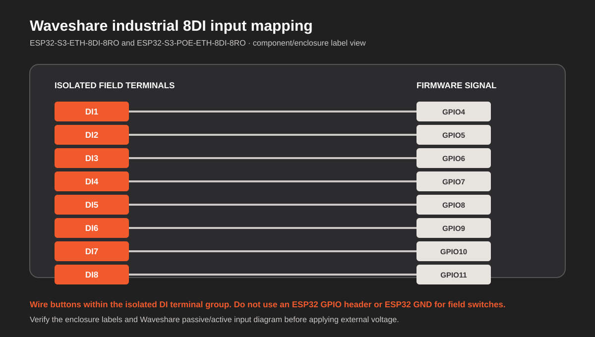
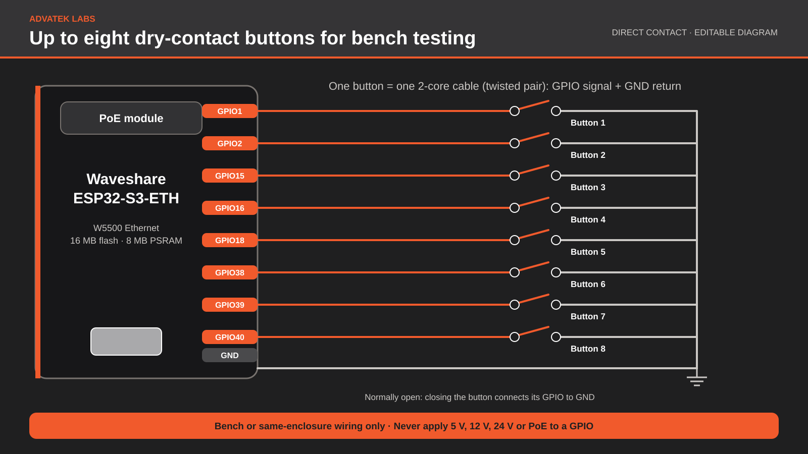
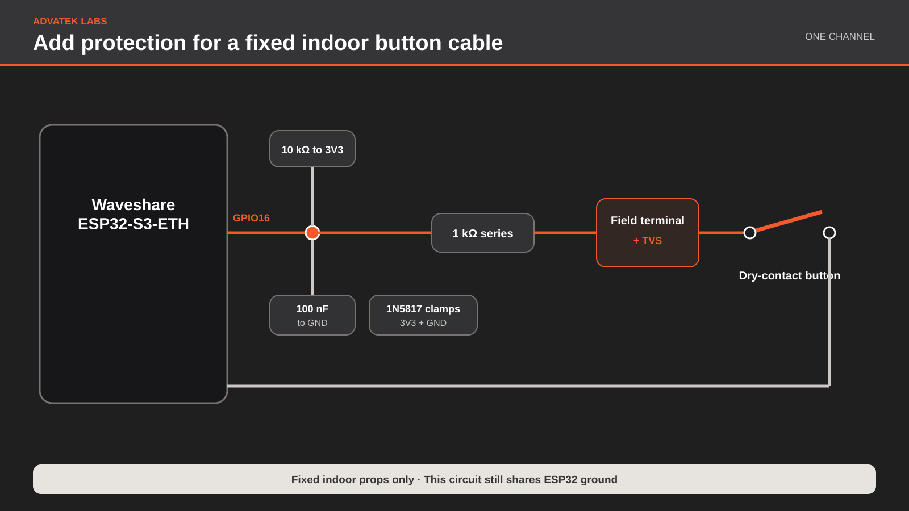
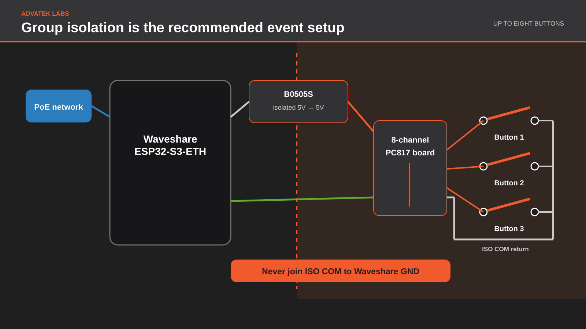

# Hardware and wiring guide

This page is the short hardware companion to the
[getting-started guide](GETTING-STARTED.md). It covers the currently supported
Waveshare boards, the parts needed for a first installation, and their project
pinouts. Read the more detailed [wiring notes](../WIRING.md) before soldering.

## Supported controller

Use the **Waveshare ESP32-S3-ETH / ESP32-S3-POE-ETH** based on ESP32-S3R8. The
PoE version is the same controller with a power-only daughterboard, so both use
the same firmware download.

- [Waveshare ESP32-S3-ETH product page](https://www.waveshare.com/esp32-s3-eth.htm)
- [Waveshare setup and reference wiki](https://www.waveshare.com/wiki/ESP32-S3-ETH)
- [Official schematic](https://files.waveshare.com/wiki/ESP32-S3-ETH/ESP32-S3-ETH-Schematic.pdf)
- [Amazon UK board search](https://www.amazon.co.uk/s?k=Waveshare+ESP32-S3-POE-ETH)

Choose a board **with pre-soldered headers** unless you are comfortable
soldering both 20-pin rows. For a one-cable installation, choose the kit that
includes the Waveshare PoE module. Do not buy a camera kit for this project.

### Industrial isolated-input option

The **Waveshare ESP32-S3-ETH-8DI-8RO** and
**ESP32-S3-POE-ETH-8DI-8RO** use a second board profile and one shared
industrial-board firmware download. They provide eight built-in isolated
digital inputs, a rail enclosure, 16 MB flash, 8 MB PSRAM, and W5500 Ethernet.

- [Waveshare product page](https://www.waveshare.com/product/esp32-s3-eth-8di-8ro.htm)
- [Official Waveshare wiki](https://www.waveshare.com/wiki/ESP32-S3-ETH-8DI-8RO)
- [Illustrated industrial PoE setup and wiring guide](GETTING-STARTED-8DI-8RO.md)

Both versions accept their labeled 7–36 V DC input. The PoE version additionally
accepts IEEE 802.3af through RJ45, allowing power and data in one cable. Both
use the same sketch because the power option does not change the ESP32 pin map.



Use the isolated `DI1`–`DI8` screw terminals. Do not add the external
optocoupler assembly intended for the Pico-header board, and do not connect
field wiring to ESP32 GPIO headers.

## First-build shopping list

| Item | Why it is needed |
| --- | --- |
| Waveshare ESP32-S3-ETH with PoE module | Runs the firmware and receives network plus power |
| IEEE 802.3af PoE switch or injector | Powers the Waveshare PoE module |
| Ethernet patch cable | Connects power and the local network |
| Data-capable USB-C cable | Required for the first firmware upload and recovery |
| PixLite Mk3 controller | Receives scene, playlist, live/test, and intensity actions |
| Volt-free push button, maintained switch, or relay contact | The physical trigger |
| Twisted-pair hookup cable | One pair per contact for short field runs |
| Enclosure, stripboard, headers, and terminal blocks | Keeps wiring secure and serviceable |

The firmware and web interface need no camera, microSD card, display, or
separate 5 V plug-pack. Begin the first upload and electrical checks on USB
power, then move to PoE.

## Which button connection should I build?

The firmware works with either connection below. The choice is about electrical
protection, not software:

| Installation | Recommended connection |
| --- | --- |
| Temporary bench test or a button inside the same enclosure | Bare dry contact from GPIO to GND |
| Short, fixed indoor cable entirely belonging to this controller | Protected direct input with two resistors, capacitor, clamps, and TVS |
| Small immersive event, public interaction, movable buttons, or a few metres of cable | **Group-isolated optocoupler input board** |
| Outdoor cable, another building, 12/24 V signals, or unknown equipment | Certified industrial isolated input—not this stripboard design |

For small immersive events, build the **group-isolated route as the default**.
It costs little more once several channels are required and keeps cable
handling, static discharge, and field ground faults away from the ESP32. It
isolates all field buttons as one group; it does not isolate each button from
the other buttons.

Editable public-guide assets are available as
[diagrams.net masters, SVG/PNG exports, and a native PowerPoint deck](assets/hardware-schematics/README.md).

## Project pinout

The drawing is viewed from the component side, with USB-C and the PoE module at
the top. Orange pins are the only GPIOs offered by this board profile. The
nearby dark pins are ground.


The eight available contact GPIOs are:

| Left header | Right header |
| --- | --- |
| GPIO16, GPIO18, GPIO15, GPIO2, GPIO1 | GPIO40, GPIO39, GPIO38 |

These positions remain reachable with the supplied PoE daughterboard fitted.
Every configured input must use a different GPIO. Pins not highlighted in the
drawing are unavailable to this project even if they appear on the board.

The drawing is a project-specific simplification based on the Waveshare
schematic and interface definition. Use the official schematic when designing
another expansion board.

## A safe first bench contact

No external resistor is required for a temporary bench test because the
firmware enables the ESP32's internal pull-up. Turn off all power and connect a
genuinely volt-free switch between one approved GPIO and a nearby GND:

```text
GPIO16 ─────────── push button ─────────── GND
```



The firmware provides the pull-up. Closing the switch pulls the input low. Do
not connect 5 V, 12 V, 24 V, a PoE conductor, or another device's powered
output to the GPIO.

After uploading the firmware:

1. Open the web interface.
2. Select **Add input**.
3. Choose the wired GPIO.
4. Leave debounce at its 100 ms default.
5. Assign a harmless PixLite test action.
6. Save, then operate the contact.

The underside LED stays Advatek orange and flashes white for every accepted,
debounced edge. If one physical operation produces two flashes, increase that
input's debounce in the web interface.

Do not use the bare connection for a public-facing button cable. The internal
pull-up and software debounce provide logic behavior, not ESD or cable-fault
protection.

## Protected direct button wiring

This non-isolated circuit is a reasonable compact option when the buttons,
cable, and controller are all part of one fixed indoor prop. Build one channel
per button at the controller end:

```text
3V3 ─────────────── 10 kΩ ────────┐
                                   ├──── GPIO
GND ─────────────── 100 nF ───────┤
                                   │
button cable signal ── 1 kΩ ──────┘
button cable return ──────────────────── GND

At the cable terminal: SA5.0CA TVS between signal and return.
At the GPIO: 1N5817 clamps to 3V3 and GND as shown in the detailed guide.
```

The external 10 kΩ resistor gives the open input a stronger, defined pull-up;
the 1 kΩ resistor limits fault and clamp current; and the 100 nF capacitor
filters short electrical spikes. These parts supplement the firmware's 100 ms
default debounce.

Here, **twisted pair** means two insulated conductors twisted around each
other inside one cable. For each button, one conductor carries its assigned
GPIO signal and the other is that button's GND return. Yes: the GPIO wire and
GND-return wire are the pair in the same two-core cable. It does not mean
twisting several GND wires together.

Use one of those pairs per button. Returns may meet at the controller GND, but
do not use one long shared return conductor between several button boxes. Keep these cables away
from mains leads, loudspeaker cables, motors, and switched loads. Add strain
relief and a labelled, pluggable terminal for every pair.

This route still shares ESP32 ground with the cable. If the buttons will be
handled by the public, moved between events, or placed a few metres away, use
the isolated route below instead.



## Medium-protection isolated input board

For the planned PoE-powered stripboard build and a few metres of switch cable,
use the group-isolated input arrangement in
[Protected contact inputs](PROTECTED-CONTACT-INPUTS.md). It keeps the field
switch common separate from ESP32 ground.

The prototype parts selected during development are:

| Part | Example UK source |
| --- | --- |
| Eight-channel PC817 optocoupler module | [Amazon UK listing](https://www.amazon.co.uk/dp/B08LVXX6MV) |
| B0505S-1W-class isolated 5 V-to-5 V converter | [Amazon UK listing](https://www.amazon.co.uk/dp/B09F3SR6W7) |
| 10 µF electrolytic capacitors | [Amazon UK listing](https://www.amazon.co.uk/dp/B07PKR4D31) |
| 100 nF ceramic capacitors | [Amazon UK listing](https://www.amazon.co.uk/dp/B0BPWPP6DZ) |
| 220 Ω, 0.5 W preload resistor | [Amazon UK search](https://www.amazon.co.uk/s?k=220+ohm+0.5W+through+hole+resistor) |

Amazon listings and module circuitry can change without changing the product
photo. Before connecting the ESP32, verify the module terminal diagram,
converter pinout, isolated output voltage, and that each logic output is no
higher than 3.3 V. The linked PC817 board must be configured for a 5 V
active-low input and 3.3 V output; do not use a 24 V PNP arrangement.

One isolated converter may supply all eight optocoupler input channels as a
group:

```text
Waveshare VSYS/5V ── B0505S input ──┐
Waveshare GND ────── B0505S input ──┘

B0505S isolated 5V ── optocoupler input VCC
B0505S isolated 0V ── ISO COM and every switch return

optocoupler output VCC ── Waveshare 3V3
optocoupler output GND ── Waveshare GND
OUT1…OUT8 ─────────────── selected GPIOs
```

Never join `ISO COM` to Waveshare GND. Fit the 100 nF and 10 µF capacitors plus
the preload resistor exactly as described in the detailed protected-input
guide. Power and meter-test the circuit over USB before attaching PoE.

Run one twisted pair to each button: one conductor is that channel's isolated
input and the other returns to `ISO COM`. All returns terminate at the
controller-side `ISO COM`; they remain completely separate from Waveshare GND.
The exact input polarity depends on the optocoupler board's NPN/PNP selector,
so follow its terminal markings and prove one channel with a meter before
wiring the remaining buttons.

On the ESP32 side, power the optocoupler outputs from **3.3 V only**, connect
their output ground to Waveshare GND, and verify every open output is at or
below 3.3 V before connecting it to a GPIO. If the module does not provide
3.3 V output pull-ups, add one 10 kΩ pull-up from each output to 3.3 V.

### Recommended event arrangement



```text
PoE Ethernet
     │
Waveshare ESP32-S3-ETH
     │ 5 V + GND
isolated B0505S converter
     │ isolated 5 V + ISO COM
8-channel optocoupler inputs
     ├── twisted pair ── Button 1
     ├── twisted pair ── Button 2
     ├── twisted pair ── Button 3
     └── twisted pair ── Button 4…8

Optocoupler 3.3 V outputs ── GPIO1/2/15/16/18/38/39/40
```

Start with four populated buttons even if using an eight-channel board. Test
each channel open and closed, then leave the input at 100 ms debounce. Increase
an individual channel to roughly 150–250 ms only if its particular switch
still produces multiple accepted edges.

## Installation boundaries

This is a low-voltage community project, not certified industrial safety
equipment. Use an enclosed, strain-relieved assembly. Keep it indoors and on a
trusted local network.

Use a certified isolated digital-input product instead of the stripboard design
for outdoor cable, cabling between buildings, mains-related contacts,
12/24 V control signals, unknown third-party equipment, or environments with
high-energy interference.
