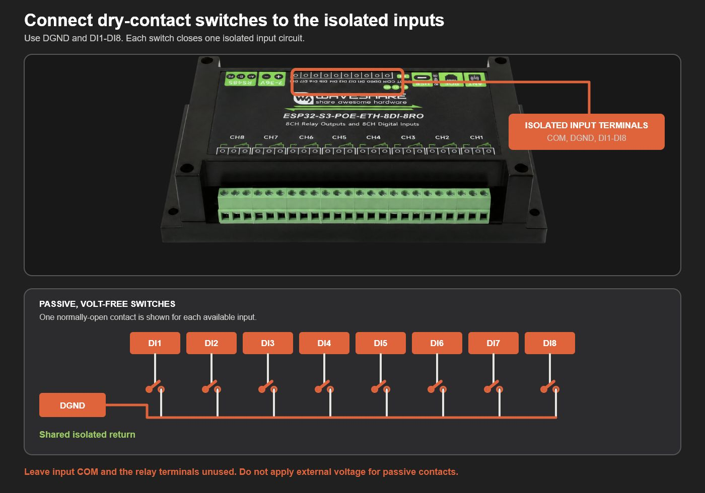
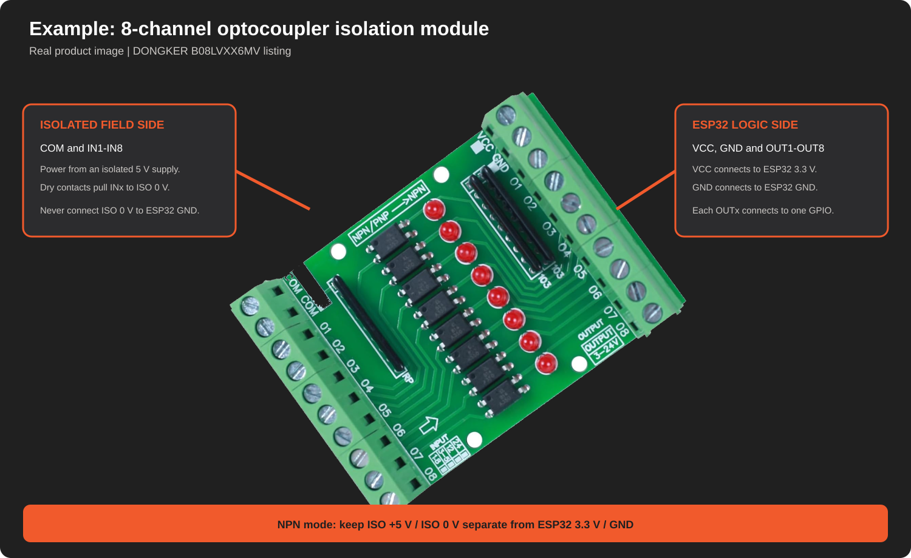

# Hardware and wiring guide

This page covers the supported Waveshare boards, the equipment needed for a
first installation, and the project pinouts. Read the
[board-specific wiring notes](../WIRING.md) before connecting hardware.

## Supported controllers

### Waveshare ESP32-S3-ETH / ESP32-S3-POE-ETH development board

Use the **Waveshare ESP32-S3-ETH / ESP32-S3-POE-ETH** based on ESP32-S3R8. The
PoE version is the same controller with a power-only daughterboard, so both use
the same firmware download.

- [Waveshare ESP32-S3-ETH product page](https://www.waveshare.com/esp32-s3-eth.htm)
- [Waveshare setup and reference wiki](https://www.waveshare.com/wiki/ESP32-S3-ETH)
- [Official schematic](https://files.waveshare.com/wiki/ESP32-S3-ETH/ESP32-S3-ETH-Schematic.pdf)

A kit with fitted headers and the Waveshare PoE module permits a one-cable
network and power installation. Camera hardware is not used by this project.

### Industrial isolated-input board

The **Waveshare ESP32-S3-ETH-8DI-8RO** and
**ESP32-S3-POE-ETH-8DI-8RO** use a second board profile and one shared
industrial-board firmware download. They provide eight built-in isolated
digital inputs, a rail enclosure, 16 MB flash, 8 MB PSRAM, and W5500 Ethernet.

- [Waveshare product page](https://www.waveshare.com/product/esp32-s3-eth-8di-8ro.htm)
- [Official Waveshare wiki](https://www.waveshare.com/wiki/ESP32-S3-ETH-8DI-8RO)
- [Illustrated industrial PoE setup and wiring guide](GETTING-STARTED-8DI-8RO.md)

The PoE version accepts IEEE 802.3af through RJ45. Both products also expose
manufacturer-provided external-DC terminals, but external-DC selection and
wiring are outside this project's v1 installation scope. The firmware download
is unchanged by the product's power option.

For passive switches, use the isolated input terminal group along the top edge
of the enclosure. Connect each switch between `DGND` and one input from `DI1`
to `DI8`. The switches may use a shared `DGND` return for a short multicore
cable, or a separate `DGND` conductor paired with each input.

Use the isolated `DI1`–`DI8` screw terminals. Do not add an external
optocoupler module to this board, and do not connect field switches to its
ESP32 GPIO headers.

## First-installation equipment

| Item | Why it is needed |
| --- | --- |
| One supported Waveshare controller | Runs the firmware |
| Correct board-specific Arduino download | Matches the selected input hardware |
| IEEE 802.3af PoE switch or injector when using PoE | Provides network and power |
| Ethernet patch cable | Connects the controller to the local network |
| Data-capable USB-C cable | Required for the first firmware upload and recovery |
| PixLite Mk3 controller | Receives scene, playlist, live/test, and intensity actions |
| Industrial-grade microSD for the PixLite Mk3 | Required by PixLite Mk3 SHOWTime for scene and playlist storage/playback |
| Volt-free push button, maintained switch, or relay contact | Provides the physical trigger |
| Low-voltage control cable | Connects remote contacts to the selected input hardware |
| Enclosure, suitable connectors, and strain relief | Keeps wiring secure and serviceable |
| Documented off-the-shelf isolated input module | Recommended when switches connected to the Waveshare ESP32-S3-ETH / ESP32-S3-POE-ETH leave the enclosure |

The ESP32 board's own TF/microSD slot is unused. It is separate from the
industrial-grade microSD required inside the PixLite Mk3 for SHOWTime.

Twisted pair is not mandatory for a short, quiet installation. Where practical,
use one pair per remote switch: one conductor carries the input signal and the
other its matching return. This can reduce noise pickup on longer runs. A short
multicore control cable may use a suitable shared return when permitted by the
selected input hardware and installation requirements.

See the
[official SHOWTime guidance](https://www.advateklighting.com/en-us/software/showtime)
for the PixLite Mk3 requirement.

## Choose the input approach

For wiring outside an enclosure, use complete, documented hardware:

| Installation | Suitable approach |
| --- | --- |
| Temporary bench test or a button fully inside the controller enclosure | Direct volt-free contact from an approved GPIO to GND |
| Short field cable, public button, portable prop, or small immersive event | **Supported industrial 8DI board or documented off-the-shelf isolated input module** |
| Existing 12/24 V controls, outdoor cable, another building, or unknown equipment | Certified industrial digital-input equipment selected and installed by a suitably qualified integrator |

The [off-the-shelf isolated-input guide](PROTECTED-CONTACT-INPUTS.md) explains
how to select a complete module without asking users to design or assemble a
PCB.

## Waveshare ESP32-S3-ETH / ESP32-S3-POE-ETH project pinout

The drawing is viewed from the component side, with USB-C and the PoE module at
the top. Orange pins are the only GPIOs offered by this board profile. Nearby
dark pins are ground.

| Left header | Right header |
| --- | --- |
| GPIO16, GPIO18, GPIO15, GPIO2, GPIO1 | GPIO40, GPIO39, GPIO38 |

These positions remain reachable with the supplied PoE daughterboard fitted.
Every configured input must use a different GPIO. Pins not highlighted in the
drawing are unavailable to this project even if they appear on the board.

The drawing is a project-specific simplification based on the Waveshare
schematic and interface definition. Use the official schematic when developing
another board profile.

## Direct same-enclosure contact

No external interface is required for a temporary bench test because the
firmware enables the ESP32's internal pull-up. Turn off all power and connect a
genuinely volt-free switch between one approved GPIO and a nearby GND.

Closing the switch pulls the input low. Never connect 5 V, 12 V, 24 V, a PoE
conductor, or another device's powered output to a GPIO.

After uploading the firmware:

1. Open the web interface.
2. Select **Add input**.
3. Choose the wired GPIO.
4. Leave debounce at its 100 ms default.
5. Assign a harmless PixLite Mk3 action.
6. Operate the contact.

The status LED flashes white for every accepted, debounced edge. If one
physical operation produces two flashes, increase that input's debounce in the
web interface.

Use this direct connection only for bench tests or buttons inside the controller
enclosure. Internal pull-ups and software debounce provide logic behaviour.
They do not provide cable-fault, transient, or surge protection.

## Off-the-shelf isolated input module

Use a commercially assembled module when a button cable connected to the
Waveshare ESP32-S3-ETH / ESP32-S3-POE-ETH leaves the enclosure.

The pictured
[DONGKER DC 3.3/5 V eight-channel optocoupler module](https://www.amazon.co.uk/dp/B08LVXX6MV)
is an electrically compatible example when its field side is powered from a
separate isolated 5 V supply and its logic side is powered at 3.3 V. It is not
a supplier recommendation. Product designs and listings can change, so confirm
the delivered module against its current terminal diagram before wiring it.

Follow the [off-the-shelf isolated-input guide](PROTECTED-CONTACT-INPUTS.md)
for the two-domain wiring arrangement. Keep the isolated field `+5 V` and
`0 V` separate from ESP32 `3.3 V` and `GND`. Verify one channel before
connecting the remaining inputs.

## Installation boundaries

This low-voltage community project carries no certified industrial safety
function. Use enclosed, strain-relieved hardware indoors on a trusted local network.

Third-party products and suppliers document compatibility. Advatek does not
endorse the listed products. Integrators must check local electrical codes, applicable
standards, manufacturer instructions, and whether qualified personnel are
required.

Advatek Technical Support does not cover third-party hardware or Advatek Labs
community projects. Use GitHub Issues for reproducible community support
requests. No urgent or show-critical support is available through this project.

Use certified industrial digital-input equipment for outdoor cable, cabling
between buildings, mains-related contacts, 12/24 V control signals, unknown
third-party equipment, or environments with high-energy interference.
