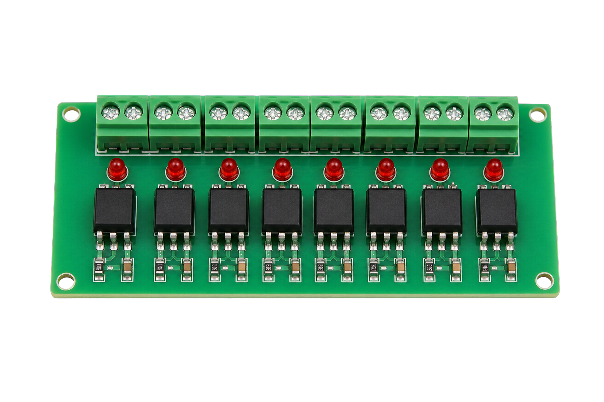

# Off-the-shelf isolated contact inputs

For buttons outside the controller enclosure, start with a **commercially
assembled optocoupler or isolated digital-input module**. Do not build a
component-level interface from this guide.

The simplest complete option is the supported Waveshare industrial 8DI board,
which already provides isolated `DI1`–`DI8` terminals. When using the
Pico-header ESP32-S3-ETH board, add an off-the-shelf multi-channel interface
module with documented dry-contact inputs and 3.3 V-compatible logic outputs.

*Illustrative module category only. Products and terminal layouts vary; this is
not a supplier recommendation or a wiring reference.*

## Choose a complete, documented module

Buy a factory-assembled module from a supplier that provides a manual, terminal
diagram, and electrical ratings. Confirm all of the following before purchase:

- its input side is designed for volt-free switches at the supply voltage
  available in the installation;
- its logic outputs are explicitly compatible with 3.3 V ESP32 inputs;
- its output behaviour is documented, including whether it is active-low,
  open-collector, or actively driven;
- the field-input and ESP32-output terminal groups are clearly identified;
- it has a published galvanic-isolation specification when isolation is
  required;
- its channel count, enclosure, terminals, temperature range, and approvals
  suit the installation; and
- the exact model remains identifiable after installation.

Do not select a module from its photograph alone. Similar-looking modules may
expect different input voltages, use different terminal orders, or share a
common ground despite being advertised as optocoupled. A module described only
as a `24 V PNP` converter is not automatically suitable for passive switches.
Never connect the nominal PoE voltage to a contact-input module.

## Which approach fits?

| Installation | Suitable approach |
| --- | --- |
| Temporary test or a button fully inside the controller enclosure | Direct volt-free contact from an approved GPIO to GND |
| Short field cable, public button, portable prop, or small immersive event | Supported industrial 8DI board or a documented off-the-shelf isolated input module |
| Existing 12/24 V controls, outdoor cable, another building, or unknown equipment | Certified industrial digital-input equipment selected and installed by a suitably qualified integrator |

Software debounce improves switch behaviour; it does not provide electrical
protection or isolation.

## Installation overview

Follow the selected module manufacturer's terminal diagram.

1. Disconnect USB, PoE, and any alternative power before wiring.
2. Identify the module's field-input side and ESP32 logic-output side from its
   manual.
3. Configure its input side for passive dry contacts using only its approved
   supply and common terminals.
4. Connect each 3.3 V-compatible logic output to one firmware-approved GPIO.
5. Connect any logic-side supply and common exactly as the module manual
   requires. Do not bridge an isolated field common to ESP32 GND.
6. Before connecting an output to the ESP32, verify from the documentation and
   by measurement that it cannot exceed 3.3 V.
7. Prove one channel open and closed before wiring the remaining channels.
8. Add the corresponding GPIO in the web interface and start with the default
   100 ms debounce.

The approved GPIOs for the Pico-header board are `GPIO1`, `GPIO2`, `GPIO15`,
`GPIO16`, `GPIO18`, `GPIO38`, `GPIO39`, and `GPIO40`. Each enabled input must
use a unique GPIO.

## Installation and support boundary

Third-party modules and suppliers document compatibility. Advatek does not
endorse the listed products. Their designs and listings can change. Integrators must confirm
the current manufacturer's documentation, follow local electrical codes and
applicable standards, and use qualified personnel where required.

Advatek Technical Support does not cover third-party input hardware or Advatek
Labs community projects. Use GitHub Issues for reproducible community
documentation or integration questions; do not rely on community support for
urgent or show-critical systems.
