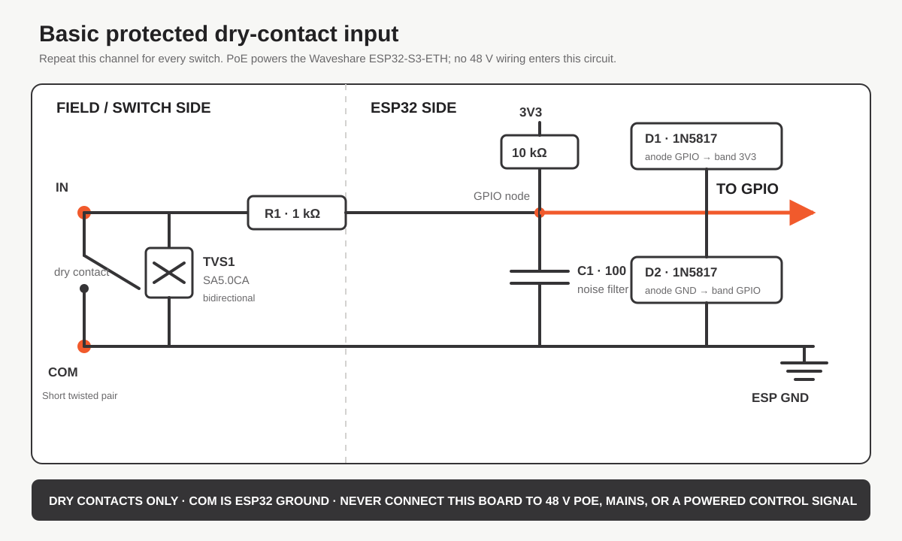

# Protected and isolated contact-input options

This is a practical stripboard interface for a PoE-powered
Waveshare ESP32-S3-ETH and a few dry-contact switches on short cable runs.
Build one identical channel per switch; four populated channels are a sensible
first version, and the same circuit can be repeated up to eight times.



## What this board does

The contact still works in the normal firmware direction: closing a switch
connects an input to `COM`, which the firmware reads as active. The added parts
provide:

- a defined 3.3 V pull-up;
- series current limiting;
- a small hardware noise filter in addition to the firmware's 100 ms debounce;
- positive and negative voltage clamps at the ESP32 input; and
- a TVS diode at the cable connector for brief cable transients and ESD.

This design is **not galvanically isolated**. `COM` is ESP32 ground. It is
appropriate for volt-free contacts on short, indoor cable runs connected only
to this controller. Do not connect mains, 12/24 V control signals, equipment
grounds, outdoor cabling, or contacts that already carry voltage. Use a
properly isolated industrial input module for those applications.

The Waveshare PoE module powers the ESP32 board in the normal way. The contact
board takes only `3V3` and `GND` from the ESP32 header. It does not connect to
the Ethernet cable, PoE input, or any 48 V PoE wiring.

## One channel

Use these connections for every input:

```text
3V3 -------- 10 kOhm --------+---------------- GPIO
                              |
                            100 nF
                              |
GND --------------------------+---------------- COM

CONTACT IN -------- 1 kOhm ---+
       |                      GPIO node above
    SA5.0CA
       |
COM / GND
```

Add two 1N5817 Schottky clamp diodes at the GPIO node:

- upper clamp: anode to GPIO, cathode (band) to `3V3`;
- lower clamp: anode to `GND`, cathode (band) to GPIO.

The `SA5.0CA` is bidirectional, so it has no installation polarity. Fit it
physically beside the field terminal, before the 1 kOhm resistor. Fit the
100 nF capacitor and Schottky diodes beside the ESP32 header.

The 1 kOhm resistor is intentionally much smaller than the 10 kOhm pull-up. A
closed contact therefore produces a clear logic-low even while the firmware's
internal pull-up remains enabled.

## Four-channel starter BOM

| Quantity | Part | Suggested specification |
| ---: | --- | --- |
| 4 | Series resistor | 1 kOhm, 0.25 W, through-hole |
| 4 | Pull-up resistor | 10 kOhm, 0.25 W, through-hole |
| 4 | Filter capacitor | 100 nF ceramic or film, at least 25 V |
| 8 | Clamp diode | 1N5817 Schottky, axial |
| 4 | Cable TVS | SA5.0CA, bidirectional, axial |
| 4 | Contact connector | Two-way 5.08 mm terminal block, `IN` and `COM` |
| 1 | Board connector | GPIOs plus `3V3` and `GND` |
| 1 | Stripboard | Large enough to maintain separate field and ESP sides |

Double every per-channel quantity for eight inputs. The protection components
do not require a separate power supply.

## Off-the-shelf optocoupler-board alternative

A low-cost PC817 input board can replace the repeated resistors, clamps, and
capacitors if compact assembly matters more than having a completely
documented protection network. Buy only a board that explicitly has all of
these characteristics:

- 5 V-capable input side;
- 3.3 V-capable output side;
- active-low, open-collector outputs;
- separate input-side and output-side power terminals; and
- a published terminal diagram or schematic.

Do **not** use a module described only as `24 V to 3.3 V PNP`. That version
expects a powered 24 V input and is not suitable for switches powered from this
board. Never substitute the PoE cable's nominal 48 V.

For the simplest short-cable installation, wire a compatible module as follows:

| Module terminal | Connection |
| --- | --- |
| Input VCC | Waveshare `VSYS` / 5 V, verified with a meter |
| Input GND | Waveshare GND |
| Input `IN1...IN8` | One side of each dry switch |
| Other side of every switch | Input GND |
| Output VCC | Waveshare `3V3`—never 5 V |
| Output GND | Waveshare GND |
| Output `OUT1...OUT8` | Assigned ESP32 GPIOs |

This shared-ground arrangement uses the optocouplers as inexpensive GPIO
protection but is **not galvanically isolated**, because both sides use the
Waveshare ground. That is acceptable for the short, local, dry-contact wiring
described here.

For genuine isolation, power the module's input side from an isolated 5 V-to-5
V DC/DC converter. Connect its isolated output to input VCC/input GND, call
that ground `ISO COM`, and do not join `ISO COM` to ESP32 GND. Keep the module
output side on ESP32 `3V3` and ESP32 GND.

### Group-isolated PoE-powered prototype

The current prototype uses one B0505S-1W-class converter to isolate the field
side of all eight contacts as a group:

```text
Waveshare VSYS/5V ─── converter VIN+
Waveshare GND ─────── converter VIN-

converter VOUT+ ───── optocoupler input-side 5V
converter VOUT- ───── ISO COM and switch-return conductors

optocoupler output VCC ─── Waveshare 3V3
optocoupler output GND ─── Waveshare GND
OUT1…OUT8 ──────────────── assigned GPIOs
```

There must be no connection between `ISO COM` and Waveshare GND. This provides
group isolation: all field contacts share one isolated common, while the field
side as a whole is isolated from the ESP32.

The selected inexpensive B0505S-1W listing specifies a 4.5–5.5 V input, 5 V
output, 20–200 mA output range, and 1 W rating. Generic B0505S modules are often
unregulated and vendor pinouts can differ. Before connecting the optocoupler
board:

1. Confirm the converter pinout from its markings or supplied data.
2. Fit 100 nF ceramic and 10 uF electrolytic capacitors across the isolated
   output, physically close to the converter.
3. Connect the electrolytic positive lead to `VOUT+` and negative lead to
   `VOUT-`; the ceramic capacitor is non-polarized.
4. Fit a 220 Ohm, 0.5 W preload resistor across `VOUT+` and `VOUT-` to keep the
   converter above its stated minimum load.
5. Power from USB first and measure the isolated output under zero, one-channel,
   and all-channel loads. It must remain within the optocoupler board's stated
   input-supply range.
6. Verify with a continuity meter that `ISO COM` remains isolated from
   Waveshare GND.

The output capacitors and preload improve converter behavior; they do not
replace isolation testing or transient protection at the field terminals.

If the module has output pull-up jumpers, they may be fitted only when output
VCC is connected to 3.3 V. Otherwise remove them and use a 10 kOhm pull-up from
each output to 3.3 V. Measure every output before connecting it to the ESP32:
it must never exceed 3.3 V, should be near 3.3 V with the contact open, and
should fall below 0.8 V with the contact closed.

Cheap PC817 modules vary internally even when their photographs look the same.
Bench-test every channel at the intended 5 V input voltage; some boards include
an indicator LED and an input resistor intended for 12/24 V, leaving too little
PC817 LED current for reliable operation at 5 V.

## Suggested GPIO order

For a small build, populate the easiest exposed pins first:

1. GPIO1
2. GPIO2
3. GPIO38
4. GPIO39
5. GPIO40, if a fifth input is required

The remaining firmware-approved choices are GPIO15, GPIO16, and GPIO18. GPIOs
33 through 37 must not be used because they are occupied internally by the
ESP32-S3R8's octal PSRAM.

The GPIO order is not electrically important. Assign the actual pins in the
web interface after assembly and keep every enabled input unique.

## Stripboard construction

Keep the contact terminals along one edge and the ESP32 header along the
opposite edge. Use one common ground rail for all `COM` terminals. Place every
TVS diode at its contact terminal, then run through the 1 kOhm series resistor
towards the GPIO side. Put each channel's 10 kOhm resistor, 100 nF capacitor,
and two clamp diodes close to its GPIO connection.

Mark both sides of every cable pair:

```text
Switch 1: IN1 + COM
Switch 2: IN2 + COM
Switch 3: IN3 + COM
Switch 4: IN4 + COM
```

Twisted-pair cable is preferred even for short runs. A pair is the two wires
twisted together inside one cable: use one wire for that switch's `IN`/GPIO
signal and the other for its `COM`/GND return. Use one complete pair per switch
and do not share a conductor with another powered circuit. Inspect every
stripboard track cut with a meter before plugging the board into the ESP32.

## Bring-up test

1. Disconnect PoE and USB while making connections.
2. With the ESP32 unplugged, verify there is no short between `3V3` and `GND`.
3. Verify each `IN` reaches only its intended GPIO through approximately
   1 kOhm.
4. Connect the interface to the ESP32, but leave all field switches open.
5. Power the ESP32 from PoE and measure approximately 3.3 V at each GPIO node.
6. Temporarily link one `IN` to its adjacent `COM`; its GPIO node should fall
   well below 0.8 V.
7. In the web interface, add that GPIO with the default 100 ms debounce and a
   harmless test action.
8. Close and open the contact repeatedly. Expect one white status-LED flash per
   debounced edge.
9. Repeat for each populated channel before assigning live PixLite actions.

If a switch occasionally causes two events, increase that input's debounce in
the web interface. Do not increase the capacitor to compensate for a wiring or
grounding fault.

## Limits

This is medium protection for a compact, local installation—not an industrial
input standard. The TVS and clamp network reduce the likelihood of damage from
brief handling and cable transients, but they do not make an ESP32 GPIO
tolerant of sustained external voltage. For cable runs outside the enclosure,
different buildings, unknown third-party equipment, or high-energy
environments, use optocouplers or a certified isolated digital-input module.
