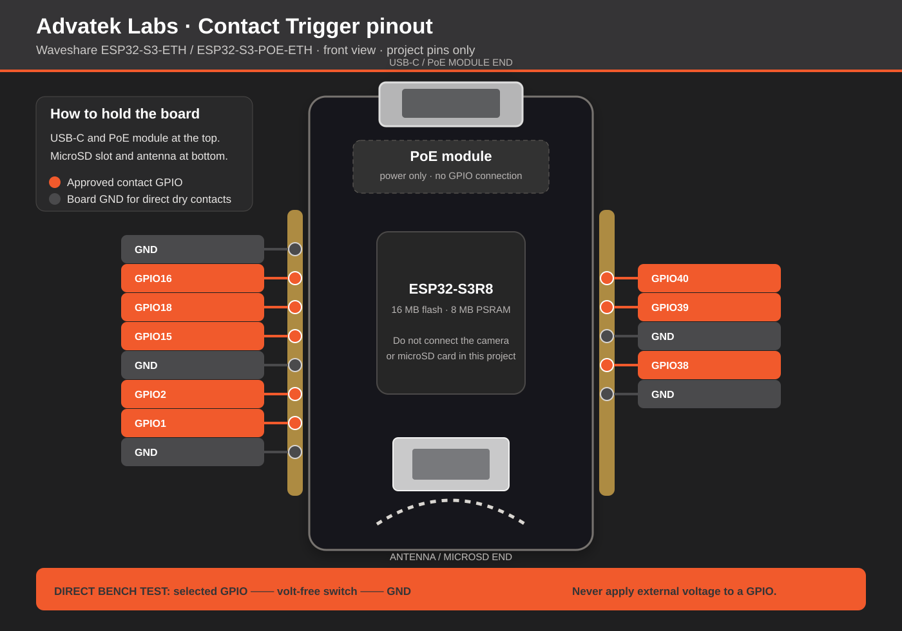

# Start here: flash the Waveshare ESP32-S3-ETH

This folder is the ready-to-open Arduino build for the Advatek Labs PixLite Mk3
Contact Closure Trigger. Do not paste or modify the firmware source.

## Upload in six steps

1. Install [Arduino IDE](https://www.arduino.cc/en/software).
2. In **Tools → Board → Boards Manager**, install `esp32` by Espressif Systems,
   version **3.3.10**.
3. Double-click `AdvatekTrigger-Waveshare-ESP32-S3-ETH.ino`.
4. Select **Tools → Board → esp32 → ESP32S3 Dev Module**.
5. Set the exact options below and select the ESP32's COM/serial port.
6. Connect the board over USB-C and click **Upload**.

| Arduino IDE option | Required value |
| --- | --- |
| Flash Size | `16MB` |
| Partition Scheme | `Huge APP (3MB No OTA/1MB SPIFFS)` |
| PSRAM | `OPI PSRAM` |
| USB Mode | `Hardware CDC and JTAG` |
| USB CDC On Boot | `Enabled` |

If upload does not begin, hold **BOOT**, briefly press **RESET**, start upload,
then release **BOOT** when Arduino IDE begins writing.

## First connection

Connect Ethernet to the same local network as the PixLite Mk3, then try:

1. `http://advatrigger.local/`
2. The numeric address printed in Arduino Serial Monitor at `115200` baud.

The web interface guides PixLite Mk3 discovery and adding the first contact.
PixLite Mk3 SHOWTime scene and playlist playback requires an industrial-grade
microSD installed in the PixLite Mk3; the ESP32 board's own TF/microSD slot is
unused.
It does not automatically fall back between Wi-Fi and Ethernet. If the
configured network cannot be reached, hold **BOOT for 5–14 seconds** and
release to start the recovery method previously selected in the web interface.
For **Wi-Fi AP**, join `Advatek-Trigger-XXXXXX`; a phone should open setup
automatically. If it does not, use a full browser at `http://192.168.4.1/`.
For **Direct Ethernet**, unplug
the normal LAN before holding BOOT, wait through the solid-white restart
indication until the controller pulses cyan, then connect one computer
directly. Power the board separately over
USB-C because a computer Ethernet port does not provide PoE. Open
`http://192.168.4.1/` within 15 minutes. Network saving uses two taps so it
works inside phone captive portals.

## Contact wiring

Use only GPIO1, GPIO2, GPIO15, GPIO16, GPIO18, GPIO38, GPIO39, or GPIO40.
Connect a genuinely volt-free switch between the selected GPIO and a nearby
GND. Never apply external voltage to a GPIO. This bare connection is for bench
testing or a button inside the same enclosure; installed event buttons should
use the protected or group-isolated input design published with the release.

The status LED is orange while running and flashes white on each accepted
contact edge. Every new input defaults to 100 ms debounce, adjustable in the
web interface.

This release remains a community beta. Bench-test the complete installation
before relying on it in a live environment. Third-party hardware references
document compatibility. Advatek does not endorse the listed products. Follow local electrical
codes, applicable standards, and manufacturer instructions.
